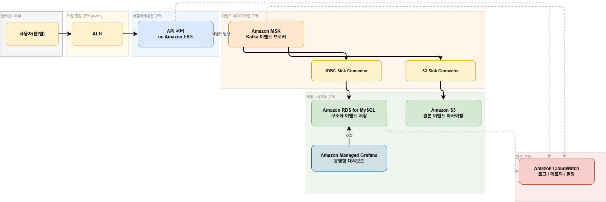

# Event Log Pipeline

퓨처스콜레 플랫폼 / 데이터 엔지니어링 인턴 채용 과제로 구현한 작은 이벤트 로그 파이프라인입니다.

이 프로젝트는 온라인 강의 플랫폼을 가정하고,

- 이벤트 생성
- MySQL 저장
- MyBatis SQL 집계
- PNG 차트 생성
- Markdown 요약 리포트 생성
- Grafana 대시보드 조회

까지 한 번에 확인할 수 있도록 구성했습니다.

이번 구현에서 중요하게 본 것은 "복잡한 기술 스택을 많이 붙이는 것"보다, 작은 범위라도 끝까지 동작하는 파이프라인을 명확하게 보여주는 것이었습니다.

## 목차

- [1. 프로젝트 개요](#1-프로젝트-개요)
- [2. 실행 방법](#2-실행-방법)
- [3. 결과 확인 방법](#3-결과-확인-방법)
- [4. 기술 스택](#4-기술-스택)
- [5. 파이프라인 구조](#5-파이프라인-구조)
- [6. 스키마 설명](#6-스키마-설명)
- [7. 왜 이렇게 설계했는가](#7-왜-이렇게-설계했는가)
- [8. 데이터 분석 항목](#8-데이터-분석-항목)
- [9. 데이터 품질 체크](#9-데이터-품질-체크)
- [10. 설정](#10-설정)
- [11. 선택과제 A](#11-선택과제-a)
- [12. 선택과제 B](#12-선택과제-b)
- [13. 구현하면서 고민한 점](#13-구현하면서-고민한-점)
- [14. 한계와 확장 방향](#14-한계와-확장-방향)
- [15. 로컬 빌드 확인](#15-로컬-빌드-확인)
- [16. 패키지 구조](#16-패키지-구조)

## 과제 요구사항 대응표

| 과제 항목 | 구현 내용 | README 위치 |
| --- | --- | --- |
| Step 1. 이벤트 생성기 작성 | EdTech 도메인 이벤트 5종(`course_view`, `course_enroll`, `lesson_start`, `lesson_complete`, `question_create`) 생성 | `1. 프로젝트 개요` |
| Step 2. 로그 저장 | MySQL `event_log` 테이블에 필드 분리 저장, 스키마와 저장소 선택 이유 설명 | `6. 스키마 설명`, `7-4. 왜 MySQL + MyBatis를 선택했는가` |
| Step 3. 데이터 집계 분석 | MyBatis 집계 SQL로 이벤트 수, 유저별 이벤트 수, 시간대 추이, 성공률, 실패 사유, 퍼널 등 분석 | `8. 데이터 분석 항목` |
| Step 4. Docker 실행 | `docker compose up --build` 한 번으로 MySQL, 앱, Grafana 실행 | `2. 실행 방법` |
| Step 5. 결과 시각화 | PNG 차트 저장 + Grafana 대시보드 구성 | `3. 결과 확인 방법`, `7-5. 왜 PNG와 Grafana를 둘 다 유지했는가` |
| 선택과제 A | Helm Chart 기반 Kubernetes 리소스 템플릿 작성 및 설명 | `11. 선택과제 A` |
| 선택과제 B | AWS 아키텍처 다이어그램 작성 및 서비스 선택 이유 설명 | `12. 선택과제 B` |
| README 필수 항목 1. 실행 방법 | 필요 도구, 설치 확인, 실행/종료 명령 정리 | `2. 실행 방법` |
| README 필수 항목 2. 스키마 설명 | 테이블 구조와 설계 이유 설명 | `6. 스키마 설명` |
| README 필수 항목 3. 구현하면서 고민한 점 | 구현 범위, 의도적 제외 사항, 설계 기준 설명 | `13. 구현하면서 고민한 점` |

## 핵심 산출물

| 산출물 | 경로 | 설명 |
| --- | --- | --- |
| 정적 차트 이미지 8개 | `output/*.png` | 집계 결과를 PNG 차트로 저장한 제출용 결과물 |
| Markdown 요약 리포트 | `output/summary.md` | 주요 지표, 인사이트, 품질 체크 요약 |
| Grafana 대시보드 정의 | `grafana/dashboards/event-log-pipeline.json` | MySQL direct query 기반 운영형 대시보드 |
| Kubernetes Helm Chart | `helm/event-log-pipeline/` | 선택과제 A 산출물 |
| AWS 아키텍처 다이어그램 | `docs/aws-architecture.png` | 선택과제 B 산출물 |
| AWS 아키텍처 편집 원본 | `docs/aws-architecture.drawio` | 다이어그램 편집 원본 |

## 1. 프로젝트 개요

실무에서 있을 법한 EdTech 도메인 이벤트를 가정해 설계했습니다.

- `course_view`: 강의 상세 페이지 조회
- `course_enroll`: 강의 수강 등록
- `lesson_start`: 강의 수강 시작
- `lesson_complete`: 강의 수강 완료
- `question_create`: 강의 질문 등록

핵심 사용자 전환 흐름은 아래처럼 정의했습니다.

```text
course_view -> course_enroll -> lesson_start -> lesson_complete
```

`question_create`는 퍼널 마지막 단계가 아니라, 수강 이후의 별도 참여 이벤트로 분리했습니다.

현재 퍼널 분석은 `session_id` 기준으로 계산합니다. 이 프로젝트에서는 한 번의 짧은 학습 흐름을 하나의 세션으로 가정했기 때문에 `course_view -> course_enroll -> lesson_start -> lesson_complete`를 같은 `session_id`로 묶었습니다.

여기서 세션의 시작점은 `course_view`입니다. 즉, 강의 상세 페이지 조회만 발생하고 이탈한 경우도 세션 1개로 집계합니다.

예를 들면 아래 두 흐름은 모두 세션으로 계산됩니다.

```text
session-101
  -> course_view
```

```text
session-102
  -> course_view
  -> course_enroll
  -> lesson_start
  -> question_create
  -> lesson_complete
```

다만 퍼널에는 `question_create`를 넣지 않았습니다. `question_create`는 같은 세션에 속하는 이벤트이지만, 모든 사용자가 반드시 순서대로 거치는 전환 단계가 아니라 수강 중 발생할 수도 있고 발생하지 않을 수도 있는 별도 참여 이벤트이기 때문입니다.

또 한 가지 구분할 점이 있습니다. `전체 세션 수`는 `course_view`가 한 번이라도 생성된 모든 `session_id`를 의미하지만, 퍼널의 첫 단계 수는 `성공한 course_view` 기준으로 계산합니다. 따라서 `course_view`가 생성되었더라도 `event_status = 'system_failure'`로 끝난 세션은 전체 세션 수에는 포함되지만 퍼널 첫 단계 수에서는 제외됩니다.

다만 실제 서비스에서 수강 신청 후 이틀 뒤에 다시 접속해 강의를 듣는 경우까지 같은 세션으로 보기는 어렵습니다. 그런 장기 흐름을 정확히 추적하려면 `session_id`만으로는 부족하고, `user_id + course_id` 조합이나 `enrollment_id`, `learning_journey_id` 같은 별도 식별자가 필요합니다.

이번 과제에서는 시뮬레이터와 퍼널 SQL을 단순하게 유지하기 위해 `session_id` 기준 분석으로 구현했지만, 실제 운영 환경으로 확장한다면 `enrollment_id`나 `learning_journey_id`를 추가해 장기 학습 흐름을 더 정확하게 추적하는 쪽이 적절하다고 판단했습니다.

EdTech 도메인 이벤트로 설계한 이유는 두 가지입니다.

1. 지원 회사의 온라인 학습 서비스 맥락과 더 자연스럽게 연결됩니다.
2. 단순 "이벤트 개수 집계"보다 실제 서비스 전환 흐름을 설명하기 쉬워집니다.

## 2. 실행 방법

필요한 도구:

- Docker
- Docker Compose v2

설치 기준:

- Windows / macOS: Docker Desktop
- Linux: Docker Engine + Docker Compose v2

설치 확인 명령:

```bash
docker --version
docker compose version
```

이 저장소는 Docker Compose v2 기준 `docker-compose.yml`을 사용했습니다. Docker Compose v2에서는 `docker compose ...` 명령으로 그대로 실행할 수 있습니다.

프로젝트 루트에서 아래 명령어를 실행합니다.

```bash
docker compose up --build
```

실행 흐름:

1. MySQL 컨테이너 시작
2. Grafana 컨테이너 시작
3. Spring Boot 앱 시작
4. `event_log` 테이블 재생성
5. 5초마다 1000건씩, 총 12회 이벤트 생성
6. MySQL에 총 12000건 저장
7. MyBatis 집계 SQL 실행
8. PNG 차트와 `summary.md` 생성
9. 앱 정상 종료

앱 컨테이너가 `Exited (0)` 상태가 되는 것은 정상입니다. 이 프로젝트는 계속 떠 있는 웹 서버가 아니라, 정해진 횟수만 실행하고 종료하는 bounded simulator입니다.

컨테이너 상태를 확인하려면 아래 명령어를 사용할 수 있습니다.

```bash
docker compose ps
```

종료:

```bash
docker compose down
```

볼륨까지 초기화:

```bash
docker compose down -v
```

## 3. 결과 확인 방법

### 정적 결과물

실행이 끝나면 `output` 디렉터리에 아래 파일이 생성됩니다.

```text
output/event_type_count.png
output/hourly_event_count.png
output/funnel_conversion.png
output/user_event_count.png
output/event_success_rate.png
output/failure_reason_distribution.png
output/endpoint_latency.png
output/course_completion_rate.png
output/summary.md
```

### Grafana 대시보드

Grafana는 MySQL을 데이터 소스로 직접 조회하도록 provisioning 했습니다. 따라서 `docker compose up --build` 한 번으로 대시보드까지 자동 구성됩니다.

대시보드 주소:

```text
http://localhost:3000/d/event-log-pipeline/event-log-pipeline-overview
```

- 익명 조회 가능

기본 패널:

- 전체 이벤트 수
- 성공한 수강 등록 수
- 총 매출
- 전체 실패율
- 이벤트 유형별 건수
- 퍼널 전환 현황
- 이벤트 유형별 성공률
- 실패 사유 분포
- 엔드포인트 평균 지연시간
- 강의별 수강 완료율
- 시간대별 이벤트 건수

## 4. 기술 스택

- Java 17
- Spring Boot 3.5.13
- MyBatis
- MySQL
- Docker Compose
- XChart
- Grafana
- Lombok
- Validation

사용하지 않은 것:

- Spring Web
- JPA
- Kafka 구현
- Kubernetes 실제 배포

Spring Web과 JPA를 넣지 않은 이유는 이번 과제의 핵심이 API 서버가 아니라 이벤트 생성 -> 저장 -> 분석 -> 시각화 파이프라인이라고 판단했기 때문입니다.

## 5. 파이프라인 구조

```text
EventGenerator
  -> EventLogService
  -> EventLogMapper(insert SQL)
  -> MySQL event_log
  -> EventLogMapper(aggregation SQL)
  -> AnalysisService
  -> AnalysisResult
  -> ChartService / SummaryReportService
  -> output/*.png + output/summary.md
  -> Grafana(MySQL direct query)
```

여기서 `batch-size`는 한 번의 시뮬레이션 실행에서 생성할 이벤트 수를 의미합니다. Spring Batch를 사용한다는 뜻은 아닙니다.

## 6. 스키마 설명

테이블명은 `event_log`입니다.

| 컬럼 | 타입 | 설명 |
| --- | --- | --- |
| `id` | BIGINT | 내부 PK |
| `event_id` | VARCHAR(36) | 이벤트 고유 ID |
| `session_id` | VARCHAR(64) | 세션 ID |
| `user_id` | INT | 사용자 ID |
| `event_type` | VARCHAR(30) | 이벤트 타입 |
| `event_status` | VARCHAR(20) | 성공 / 비즈니스 실패 / 시스템 실패 |
| `failure_reason` | VARCHAR(50) | 실패 사유 |
| `http_status` | INT | 대표 응답 상태 코드 |
| `endpoint` | VARCHAR(100) | 이벤트가 발생한 요청 경로 |
| `device_type` | VARCHAR(20) | 기기 타입 |
| `country` | VARCHAR(2) | 국가 코드 |
| `course_id` | INT | 강의 ID |
| `price` | DECIMAL(12,2) | 수강 등록 금액 |
| `latency_ms` | INT | 처리 시간 |
| `created_at` | DATETIME | 이벤트 발생 시각 |

필드를 이렇게 둔 이유는 세 가지입니다.

1. `event_id`, `session_id`, `user_id`, `created_at`으로 이벤트 단위 추적, 세션 기준 퍼널 분석, 사용자 기준 집계를 할 수 있어야 했습니다.
2. `event_type`, `event_status`, `failure_reason`, `http_status`, `endpoint`, `latency_ms`로 성공률, 실패 원인, 응답 상태, 지연시간 같은 운영/분석 지표를 같이 볼 수 있어야 했습니다.
3. `course_id`, `price`, `device_type`, `country`로 강의별 분석, 매출 집계, 디바이스별/국가별 분포 분석이 가능해야 했습니다.

인덱스는 아래 네 가지에만 두었습니다.

- `created_at`
- `event_type`
- `event_status`
- `(session_id, event_type)`

이유는 시간대 집계, 이벤트 타입별 집계, 실패 상태 필터링, 세션 기준 퍼널 분석이 현재 주요 조회 패턴이기 때문입니다.

인덱스를 더 많이 둘 수도 있었지만, 이벤트 로그 테이블은 쓰기 비중이 높기 때문에 보조 인덱스를 과도하게 늘리면 insert 비용과 저장 비용이 함께 증가합니다. 이번 과제에서는 모든 조회를 커버링 인덱스로 최적화하기보다, 실제로 쓰는 핵심 집계 패턴에 필요한 범위만 두는 쪽을 선택했습니다. 실무에서는 `EXPLAIN`과 실제 쿼리 패턴을 기준으로 다시 조정하는 것이 맞습니다.

`endpoint`는 실제 Spring MVC endpoint가 아닙니다. Spring Web 의존성은 추가하지 않았고, `/courses/{id}/enroll`, `/lessons/start` 같은 값은 "실제 서비스라면 이 요청 경로에서 이벤트가 발생했을 것"이라는 가정으로 로그 필드에 저장했습니다.

MySQL과 MyBatis를 선택한 이유는 [Section 7-4](#7-4-왜-mysql--mybatis를-선택했는가)에서 설명합니다.

## 7. 왜 이렇게 설계했는가

### 7-1. EdTech 도메인 이벤트를 설계한 이유

이벤트 자체를 EdTech 도메인으로 두고, 퍼널도 학습 서비스 흐름에 맞춰 구성했습니다. 이렇게 하면 서비스 맥락에 맞는 설명이 가능하고, `question_create` 같은 참여 이벤트를 전환 퍼널과 분리해서 해석할 수 있습니다.

### 7-2. `event_status`, `failure_reason`, `http_status`를 추가한 이유

처음에는 단순 행동 로그만 저장할 수도 있었습니다. 하지만 그렇게 만들면 "행동이 있었는가"는 알 수 있어도, "그 행동이 성공했는가", "왜 실패했는가"는 알기 어렵습니다.

그래서 모든 이벤트에 아래 상태 모델을 추가했습니다.

- `event_status`
  - `success`
  - `business_failure`
  - `system_failure`
- `failure_reason`
  - `payment_declined`
  - `already_enrolled`
  - `not_enrolled`
  - `timeout`
  - `db_lock`
  - `cdn_error`
  - 그 외 이벤트별 실패 사유
- `http_status`
  - `200`, `409`, `500`, `504`

이 구조를 선택한 이유:

- 같은 `course_enroll` 이벤트라도 성공 / 비즈니스 실패 / 시스템 실패를 구분할 수 있음
- 비즈니스 실패는 정책, UX, 결제 흐름 문제로 해석할 수 있음
- 시스템 실패는 인프라, 연동, 성능 문제로 해석할 수 있음
- 실패를 별도 이벤트 타입으로 분리하는 것보다 "어떤 행동이 왜 실패했는가"를 직접 추적하기 쉬움

`http_status`는 실제 서비스 응답을 완전히 재현한 것은 아니고, 분석을 단순화하기 위한 대표 코드로 매핑했습니다.

- `success` -> `200`
- `business_failure` -> `409`
- `system_failure` -> `500` 또는 `504`

즉, 이 필드는 "실제 API 응답 구현"이 아니라 "실패 유형을 함께 해석하기 위한 보조 지표"입니다.

### 7-3. 왜 단일 `event_log` 테이블을 썼는가

이벤트별 상세 테이블을 따로 두는 구조도 검토했습니다. 예를 들어 `course_enroll_detail`, `lesson_detail`처럼 분리하면 도메인별 모델은 더 깔끔해질 수 있습니다.

하지만 이번 과제에서는 단일 `event_log` 테이블을 선택했습니다.

이유는 아래와 같습니다.

1. 현재 이벤트 타입이 5개이고, 이벤트별 상세 필드가 과도하게 많지 않습니다.
2. 이번 과제의 핵심은 트랜잭셔널 모델링보다 이벤트 생성 -> 저장 -> 집계 -> 시각화를 끝까지 연결하는 것입니다.
3. 단일 테이블이 insert 로직과 집계 SQL을 가장 단순하게 유지할 수 있습니다.

즉, 지금 단계에서는 "확장성만을 위해 구조를 쪼개는 것"보다 "분석 가능한 파이프라인을 명확하게 완성하는 것"이 더 중요하다고 판단했습니다.

다만 이벤트 타입과 속성이 크게 늘어나 nullable 컬럼이 과도해지면, 아래 두 방향을 검토할 수 있습니다.

- `raw event + payload JSON` 구조
- 공통 `event_log` + 이벤트별 detail table 구조

### 7-4. 왜 MySQL + MyBatis를 선택했는가

MySQL을 선택한 이유:

- 필드 단위 저장과 SQL 집계가 자연스럽습니다.
- 과제 범위에서 이벤트 타입 집계, 성공률, 실패 사유 분석, 시간대 분석을 수행하기에 충분합니다.
- Docker Compose로 재현하기 쉽습니다.

MyBatis를 선택한 이유:

- 집계 SQL이 XML에 그대로 드러나서 평가자가 어떤 분석을 하는지 바로 볼 수 있습니다.
- 이번 과제는 단순 CRUD보다 집계 쿼리 비중이 높아서, SQL을 직접 제어하기 쉬운 방식이 더 적합하다고 판단했습니다.

### 7-5. 왜 PNG와 Grafana를 둘 다 유지했는가

과제의 시각화 요구사항은 아래 두 방식 중 하나를 선택하면 됩니다.

- 차트 생성 후 이미지 파일로 저장
- BI 도구 대시보드 구성

이 프로젝트에서는 둘을 함께 가져갔습니다.

PNG를 유지한 이유:

- 평가자가 `output` 폴더만 봐도 결과를 바로 확인할 수 있습니다.
- 실행 결과가 정적 파일로 남아 제출물로 다루기 쉽습니다.
- `docker compose up --build` 한 번으로 끝까지 자동화된 흐름을 보여주기 좋습니다.

Grafana를 추가한 이유:

- 플랫폼 관점에서 운영형 시각화를 함께 보여줄 수 있습니다.
- MySQL datasource와 dashboard provisioning을 코드로 관리할 수 있습니다.
- 사용자가 URL 하나로 대시보드를 바로 확인할 수 있습니다.

즉, PNG는 제출용 산출물, Grafana는 운영형 관찰 도구라는 역할로 나누었습니다.

## 8. 데이터 분석 항목

MyBatis XML에 아래 집계 SQL을 작성했습니다.

- 이벤트 유형별 발생 건수
- 유저별 총 이벤트 수
- 시간대별 이벤트 발생 건수
- 세션 기준 퍼널 전환율
- 이벤트 유형별 성공률
- 비즈니스 실패 vs 시스템 실패 건수
- 실패 사유 분포
- endpoint별 평균 latency
- 강의별 수강 완료율
- 데이터 품질 체크
- 전체 요약 지표

`output/summary.md`에는 아래 지표가 함께 정리됩니다.

- 전체 이벤트 수
- 전체 세션 수
- 성공 수강 등록 수
- 수강 완료 수
- 질문 등록 수
- 총 매출
- 비즈니스 실패 수
- 시스템 실패 수
- 전체 실패율
- 평균 latency
- 최다 실패 사유
- 주요 인사이트
- 데이터 품질 체크 결과
- 강의별 성과

현재 분석 결과는 별도 테이블에 다시 저장하지 않습니다. 원천 데이터는 `event_log`에 저장하고, 분석 시점에 집계 SQL을 실행해 `AnalysisResult`로 묶은 뒤 PNG와 `summary.md`를 생성합니다. Grafana도 집계 결과 파일을 읽는 것이 아니라 MySQL을 직접 조회합니다.

## 9. 데이터 품질 체크

단순히 데이터를 저장하는 것에서 끝나지 않고, 적재 결과가 설계 의도와 맞는지도 확인하고 싶었습니다.

현재는 아래 8개 항목을 점검합니다.

- 중복 `event_id` 건수
- 정의되지 않은 `event_type` 건수
- `course_enroll`인데 `price`가 null인 건수
- 실패인데 `failure_reason`이 없는 건수
- 성공인데 `failure_reason`이 존재하는 건수
- 성공인데 `http_status`가 200이 아닌 건수
- 성공한 수강 등록 없이 `lesson_start`가 발생한 세션 수
- 성공한 `lesson_start` 없이 `lesson_complete`가 발생한 세션 수

현재 구현에서는 이 결과를 `summary.md`에 기록하는 사후 점검 용도로 사용합니다. 실무에서도 데이터 품질 체크 자체는 자주 사용하지만, 보통은 배치 실패 처리, 모니터링, 알람과 함께 운영됩니다.

## 10. 설정

기본 설정은 `src/main/resources/application.yml`에 있습니다.

```yaml
simulation:
  enabled: true
  interval-seconds: 5
  batch-size: 1000
  max-runs: 12
  seed: 42
```

`seed`는 난수 생성의 초기값입니다. 이를 고정해 실행마다 비슷한 이벤트 분포와 흐름을 재현할 수 있도록 했습니다.

## 11. 선택과제 A

선택과제 A는 raw manifest 대신 Helm Chart로 작성했습니다.

차트 경로:

```text
helm/event-log-pipeline/
```

구성 파일:

```text
helm/event-log-pipeline/Chart.yaml
helm/event-log-pipeline/values.yaml
helm/event-log-pipeline/values-dev.yaml
helm/event-log-pipeline/values-prod.yaml
helm/event-log-pipeline/templates/job.yaml
helm/event-log-pipeline/templates/configmap.yaml
helm/event-log-pipeline/templates/secret.yaml
```

### 11-1. 선택한 Kubernetes 리소스의 역할

- `Job`
  - 현재 앱은 요청을 계속 받는 웹 서버가 아니라, 한 번 실행되고 종료되는 bounded simulator입니다.
  - 그래서 `Deployment`보다 `Job`이 더 자연스럽다고 판단했습니다.
  - 반대로 이 애플리케이션이 계속 떠 있으면서 REST API 요청을 받는 서버였다면, `Job`보다는 `Deployment`와 `Service` 조합이 더 적합했을 것입니다.

- `ConfigMap`
  - datasource URL, output directory, simulation 설정처럼 일반 설정을 이미지와 분리하기 위해 사용했습니다.

- `Secret`
  - DB 연결에 필요한 민감한 값을 일반 설정과 분리해 다루는 방식을 보여주기 위해 사용했습니다.
  - 이번 과제에서는 실제 자격 증명이 아니라 placeholder 값만 넣었고, 실제 운영 환경에서는 Vault, AWS Secrets Manager, External Secrets Operator, 또는 저장소에 커밋하지 않는 별도 비공개 values 파일 같은 방식으로 관리하는 편이 더 적절합니다.

### 11-2. Helm Chart를 선택한 이유

이번 선택과제에서는 raw manifest를 환경마다 복제하는 대신, `Job + ConfigMap + Secret` 구조는 템플릿으로 유지하고 환경별 차이는 values 파일로 분리했습니다.

그 이유는 두 가지입니다.

1. 동일한 리소스 구조를 반복 작성하지 않고 재사용할 수 있습니다.
2. 개발/운영 환경 차이를 values 파일로 분리해 Helm을 왜 사용하는지 더 직접적으로 보여줄 수 있습니다.

### 11-3. dev / prod values 분리

`values.yaml`은 공통 기본값이고, 아래 두 파일로 환경 차이를 나눴습니다.

- `values-dev.yaml`
  - 개발 환경 가정
  - 작은 `batchSize`, 적은 `maxRuns`, dev 이미지 태그 사용

- `values-prod.yaml`
  - 운영 환경 가정
  - 기본 실행 규모 유지, prod DB host 가정, 운영용 이미지 태그 사용

즉, 이번 차트는 "리소스 구조는 그대로 두고, 환경별 설정만 바꾼다"는 Helm의 기본 장점을 보여주는 데 목적이 있습니다.

### 11-4. Secret placeholder를 사용한 이유

이번 과제에서는 실제 클러스터 배포를 하지 않기 때문에, Helm values 파일에는 실제 자격 증명이 아니라 placeholder 값만 넣었습니다.

예:

- `change-me-user`
- `change-me-password`

실제 운영 환경에서는 Helm values 파일에 평문 비밀번호를 커밋하지 않고, Vault 같은 Secret 관리 도구를 사용하거나 배포 시점에 저장소에 커밋하지 않는 별도 비공개 values 파일로 주입하는 방식이 더 적절합니다.

### 11-5. Helm 검증 방식

로컬 Windows 환경에는 `helm` 바이너리가 직접 설치되어 있지 않아, Docker 기반 Helm 컨테이너로 차트를 검증했습니다.

검증 범위:

- `helm lint`
- `values-dev.yaml` 기준 `helm template` 렌더링 검증
- `values-prod.yaml` 기준 `helm template` 렌더링 검증

예시 명령:

```powershell
docker run --rm -v "${PWD}:/workspace" -w /workspace alpine/helm:3.15.4 lint helm/event-log-pipeline
docker run --rm -v "${PWD}:/workspace" -w /workspace alpine/helm:3.15.4 template event-log-pipeline helm/event-log-pipeline -f helm/event-log-pipeline/values-dev.yaml
docker run --rm -v "${PWD}:/workspace" -w /workspace alpine/helm:3.15.4 template event-log-pipeline helm/event-log-pipeline -f helm/event-log-pipeline/values-prod.yaml
```

여기서 확인한 것은 차트 문법과 values 치환 결과입니다. 실제 애플리케이션 실행까지 검증한 것은 아니며, Secret에는 placeholder 값을 사용했기 때문에 DB 연결이 필요한 런타임 검증과는 구분됩니다.

### 11-6. 이번 선택과제에서 의도적으로 제외한 것

- MySQL 자체를 Kubernetes 리소스로 구성하는 작업
- Ingress
- HPA
- PV/PVC
- 실제 클러스터 배포

선택과제 A의 목적이 Kubernetes 기초 이해라고 판단했기 때문에, 리소스 역할과 선택 이유가 가장 잘 드러나는 범위까지만 구현했습니다.

## 12. 선택과제 B

선택과제 B에서는 현재 저장소의 구현을 그대로 AWS에 한 번 실행하는 구조가 아니라, 이를 실제 온라인 강의 플랫폼 운영 환경으로 확장한다는 가정 아래 아키텍처를 설계했습니다.

현재 로컬 구현은 end-to-end 흐름을 보여주기 위한 bounded simulator이지만, 운영 환경에서는 앱 서버가 실제 이벤트를 발행하고 별도 소비 계층이 저장과 후속 처리를 담당하는 구조가 더 자연스럽다고 판단했습니다.

현재 구현은 `EventGenerator → MySQL`로 직접 연결되는 단순한 구조입니다. AWS 운영 설계에서는 여기에 `Amazon MSK`를 이벤트 브로커 계층으로 추가했습니다. 이유는 운영 환경에서는 이벤트 생산과 소비를 분리해 내구성과 재처리 가능성을 확보하는 것이 더 적합하기 때문입니다. 이 방향은 현재 구현의 `README 14번(한계와 확장 방향)` 에서 Kafka를 확장 방향으로 명시한 내용과도 일치합니다.

최종 AWS 아키텍처 다이어그램은 아래와 같습니다.



- 편집 원본: `docs/aws-architecture.drawio`
- 이미지 파일: `docs/aws-architecture.png`

### 12-1. 주요 구성

- `ALB`
  - 외부 요청을 애플리케이션 서버로 전달하는 진입점

- `Amazon EKS`
  - API 서버를 운영하는 Kubernetes 기반 실행 환경
  - API 서버는 웹/앱 요청을 처리하고 MSK로 이벤트를 발행하는 역할을 담당
  - 선택과제 A의 Helm Chart를 그대로 배포할 수 있는 Kubernetes 기반 환경
  - EC2 Managed Node Group 기준으로 운영한다고 가정

- `Amazon MSK`
  - Kafka 기반 이벤트 브로커
  - API 서버(Producer)가 이벤트를 발행하면, MSK Connect가 MSK에서 각 저장소로 데이터를 전달
  - 현재 구현에는 없지만 운영 환경으로 확장 시 자연스럽게 추가되는 계층

- `MSK Connect`
  - MSK에서 이벤트를 읽어 저장소로 전달하는 관리형 Kafka Connect 실행 환경
  - JDBC Sink Connector로 RDS에 구조화 데이터 적재, S3 Sink Connector로 원본 이벤트 아카이빙
  - 저장 목적지가 늘어나도 커넥터를 추가하는 방식으로 확장할 수 있어 운영 확장성이 높음

- `Amazon RDS for MySQL`
  - 구조화된 이벤트 저장소
  - MSK Connect의 JDBC Sink Connector가 MSK에서 읽은 이벤트를 정형 데이터로 적재
  - 현재 MySQL 스키마와 SQL 집계 구조를 그대로 이어가기 위한 선택

- `Amazon S3`
  - 원본 이벤트 아카이빙 저장소
  - 이 프로젝트의 이벤트(course_view, lesson_start 등)는 클릭스트림·행동 로그 성격이 강해 S3 아카이빙이 자연스러운 선택
  - MSK Connect의 S3 Sink Connector가 MSK에서 원본 이벤트를 파일로 적재
  - RDS는 현재 운영 쿼리용, S3는 장기 보관 및 원본 기반 재처리용으로 역할을 나눔

- `Amazon Managed Grafana`
  - 운영형 시각화 서비스
  - 현재 로컬 Docker 기반 Grafana를 AWS 관리형 서비스로 치환한 형태
  - `Amazon RDS for MySQL`을 데이터 소스로 직접 조회해 대시보드를 구성한다고 가정

- `Amazon CloudWatch`
  - 로그, 메트릭, 알람 수집
  - `Amazon EKS` 클러스터의 API 서버, `Amazon MSK`, `Amazon RDS for MySQL`의 상태를 관측한다고 가정
  - `MSK Connect`도 별도 서비스로 CloudWatch 연동이 가능하며(`AWS/KafkaConnect` 네임스페이스), 커넥터 task 오류나 처리 실패를 탐지할 수 있음. 다이어그램에서는 화살표 복잡도를 줄이기 위해 별도 연결은 생략했음

### 12-2. 서비스 선택 이유

이번 설계에서는 AWS가 제공하는 관리형 서비스를 우선적으로 사용했습니다. 그 이유는 운영 부담을 줄이면서도, 현재 로컬 구현의 역할을 AWS 환경에서 어떻게 치환할지 설명하기 쉬웠기 때문입니다.

예를 들어:

- `Amazon EKS`는 선택과제 A에서 작성한 Helm Chart를 그대로 배포할 수 있어 Kubernetes 구성과 일관성이 유지됩니다.
- `Amazon MSK`와 `MSK Connect`는 이벤트 브로커 계층과 저장 전달 계층을 관리형으로 운영할 수 있습니다.
- `Amazon RDS for MySQL`은 현재 MySQL 스키마와 SQL 집계 쿼리를 유지하는 데 유리합니다.
- `Amazon Managed Grafana`는 현재 로컬 Grafana를 AWS 관리형 서비스로 대체한다는 연결이 가능합니다.

### 12-3. 가장 고민한 부분

이번 설계에서는 AWS 서비스 선택을 정할 때 몇 가지 비교 지점을 두고 판단했습니다.

최종적으로는 현재 구현의 Docker/Kubernetes/MySQL/Grafana 구조를 가능한 한 자연스럽게 AWS 서비스로 치환하는 쪽을 우선했습니다.

- `Amazon EKS vs ECS`
  - 선택과제 A에서 이미 Helm Chart와 Kubernetes 리소스를 정리했기 때문에, AWS 환경에서도 같은 Kubernetes 운영 흐름을 이어가는 쪽이 자연스럽다고 봤습니다.
  - 이번 선택과제 B에서는 단순 컨테이너 실행 편의성보다 선택과제 A와의 일관성을 더 중요하게 봐서 `Amazon EKS`를 선택했습니다.

- `Amazon MSK vs SQS`
  - SQS도 높은 처리량을 지원하지만, 기본 모델은 처리할 메시지를 큐에 넣고 소비 후 제거하는 작업 큐에 더 가깝습니다.
  - 반면 이번 과제의 대상은 지속적으로 쌓이는 이벤트 로그 스트림에 가깝고, 운영 환경에서는 재처리와 목적지 확장이 중요하다고 봤습니다.
  - 그래서 SQS보다 `Amazon MSK`가 더 적합하다고 판단했습니다. MSK(Kafka)는 메시지 보존 기간 동안 재처리가 가능하고, 소비자 그룹이 늘어나도 서로 독립적으로 오프셋을 관리할 수 있으며, MSK Connect를 통해 JDBC Sink, S3 Sink 커넥터를 관리형으로 실행하면 저장 목적지가 늘어나도 커넥터를 추가하는 방식으로 확장할 수 있습니다.

- `Amazon RDS vs DynamoDB`
  - 현재 구현의 저장소는 MySQL 기반이고, 집계도 MyBatis SQL로 작성되어 있습니다.
  - 따라서 운영 환경에서도 현재 스키마와 집계 쿼리를 가장 자연스럽게 이어가기 위해 `DynamoDB`보다 `Amazon RDS for MySQL`이 더 적합하다고 판단했습니다.

- `ALB vs API Gateway`
  - 이번 설계의 앞단은 API 제품 관리보다는 컨테이너 기반 앱 서버를 받아주는 진입점 성격이 더 강합니다.
  - 그래서 외부 진입 계층은 `API Gateway`보다 `ALB`가 더 자연스럽다고 봤습니다.

- `Amazon Managed Grafana vs self-managed Grafana`
  - 현재 로컬에서는 Docker 기반 Grafana를 사용하지만, AWS 운영 환경에서는 시각화 계층도 관리형으로 치환하는 편이 운영 부담을 줄이기 쉽습니다.
  - 그래서 self-managed Grafana보다 `Amazon Managed Grafana`를 우선적으로 고려했습니다.

## 13. 구현하면서 고민한 점

이번 구현에서 가장 크게 고민한 부분은 "과제 범위를 넘지 않으면서도, 실제 운영과 분석 맥락에 더 가깝고 완성도 높은 결과물을 만드는 것"이었습니다.

그래서 다음 기준으로 판단했습니다.

1. 먼저 필수 요구사항을 끝까지 동작하게 만든다.
2. 그 위에 서비스 맥락이 보이는 이벤트 설계를 얹는다.
3. 성공/실패/원인 분석처럼 실제로 해석 가능한 필드를 추가한다.
4. 정적 결과물과 운영형 대시보드를 함께 제공한다.

반대로 의도적으로 하지 않은 것도 있습니다.

- Spring Web API 구현
- JPA 도입
- Kafka 실제 연동
- Kubernetes 실제 배포

이 항목들은 지금 과제의 필수 범위를 넘기 때문입니다. 억지로 넣기보다 현재 범위에서 설계와 결과물이 명확한 쪽이 더 낫다고 판단했습니다.

## 14. 한계와 확장 방향

현재 구현은 과제 범위에 맞춘 작은 파이프라인입니다. 실제 운영 환경에서는 아래와 같은 확장이 필요할 수 있습니다.

### Kafka

대용량 이벤트 수집 단계에서는 Kafka를 이벤트 브로커이자 내구성 있는 전달 계층으로 두는 구성이 더 자연스럽습니다.

예시:

```text
EventGenerator
  -> Kafka Producer
  -> Kafka Topic
  -> JDBC Sink Connector
     -> MySQL
  -> S3 Sink Connector
     -> S3
  -> Analysis
  -> Chart / Dashboard
```

이번 과제에서는 Kafka를 직접 구현하지 않았습니다. 이유는 먼저 MySQL 기반의 최소 파이프라인을 명확히 완성하는 편이 우선이라고 봤기 때문입니다.

### 스키마 구조

현재는 단일 `event_log` 테이블로 충분하지만, 이벤트 타입과 속성이 크게 늘어나면 아래 방향 중 하나를 검토할 수 있습니다.

- 공통 이벤트 로그 + detail table
- raw event + payload JSON + 정제 테이블

### 집계 결과 저장

현재 구현은 실행마다 원천 데이터를 새로 생성하는 bounded simulator입니다. 따라서 장기 누적 데이터를 전제로 한 일별 집계 테이블은 두지 않았습니다.

장기간 운영 환경이라면 아래 방향을 추가로 검토할 수 있습니다.

- 원천 로그 누적 저장
- `run_date` 또는 `batch_id` 같은 실행 구분 컬럼 추가
- `daily_event_summary` 같은 일별 집계 테이블 추가

## 15. 로컬 빌드 확인

Docker 없이 테스트만 실행하려면 아래 명령어를 사용합니다.

```bash
./gradlew test
```

Windows PowerShell:

```powershell
.\gradlew.bat test
```

## 16. 패키지 구조

```text
src/main/java/com/shyu/eventlogpipeline
  domain
  dto
  mapper
  service
  simulation
```

- `domain`: 저장 도메인
- `dto`: 집계 결과 DTO
- `mapper`: MyBatis Mapper
- `service`: 저장, 분석, 차트/리포트 생성
- `simulation`: 이벤트 생성 및 실행 흐름
